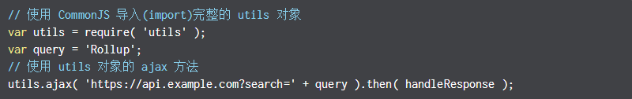
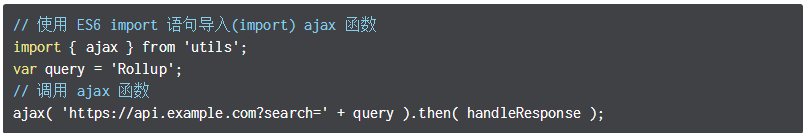

# Rollup (模块打包器)
## 安装
> cnpm install -g rollup
## 命令
> 应用程序入口 main.js(import *.js) 出口 bundle.js
> - 浏览器 rollup main.js --format iife --output bundle.js
> - Nodejs rollup main.js --format cjs --output bundle.js
> - 浏览器&&Nodejs rollup main.js --format umd --name "myBundle" --output bundle.js
## Tree Shaking
> 除了使用 ES6 模块之外，Rollup 还静态分析代码中的 import，并将排除任何未实际使用的代码。这允许您架构于现有工具和模块之上，而不会增加额外的依赖或使项目的大小膨胀
> - 在使用 CommonJS 时，必须导入(import)完整的工具(tool)或库(library)对象
> 
> - 但是在使用 ES6 模块时，无需导入整个 utils 对象，我们可以只导入(import)我们所需的 ajax 函数
> 
> - rollup
>  
>  
## 兼容性
> Rollup 可以通过[rollup-plugin-commonjs](https://github.com/rollup/rollup-plugin-commonjs)插件导入已存在的 CommonJS 模块
## 创建配置文件 rollup.config.js
```
export default {
  entry: 'src/main.js',
  format: 'cjs',
  dest: 'dest/bundle.js' // 相当于 --output
};
```
## 开始项目中使用
> 创建 package.json `npm init -y`
> 本地安装 cnpm install rollup --save-dev
>          cnpm install --save-dev rollup-watch
> 配置package.json
```
"scripts": {
  "build": "rollup -c",
  "dev": "rollup -c -w" //当文件更新，用npm run dev 重新构建
},
```
> 运行 npm run dev 或 npm run build
> 

## 安装babel
> cnpm install rollup-plugin-babel babel-preset-latest babel-core babel-plugin-external-helpers--save-dev
> 新建.babelrc
```
{
  "presets": [
    ["latest", {
      "es2015": {
        "modules": false
      }
    }]
  ],
  "plugins": ["external-helpers"]
}
```
> 修改rollup.config.js
```
//import resolve from 'rollup-plugin-node-resolve';
import babel from 'rollup-plugin-babel';
export default {
  entry: 'src/main.js',
  format: 'cjs',
  plugins: [
    //resolve(),
    babel({
      exclude: 'node_modules/**' // 仅仅转译我们的源码
    })
  ],
  dest: 'bundle.js'
};
```
## 使用 less、postcss
> cnpm i -D autoprefixer postcss rollup-plugin-less

## 使用 uglify
> cnpm i -D rollup-plugin-uglify

## Sourcemaps
```
export default {
  entry: 'src/main.js',
  format: 'umd',
  dest: 'bundle.js',
  sourceMap: true
};
```
## Rollup 和 Gulp结合使用
```
var gulp = require('gulp'),
    rollup = require('rollup'),
    rollupTypescript = require('rollup-plugin-typescript');
gulp.task('build', function () {
  return rollup.rollup({
    entry: "./src/main.ts",
    plugins: [
      rollupTypescript()
    ],
  }).then(function (bundle) {
      bundle.write({
        format: "umd",
        moduleName: "library",
        dest: "./dist/library.js",
        sourceMap: true
      });
  })
});
```


